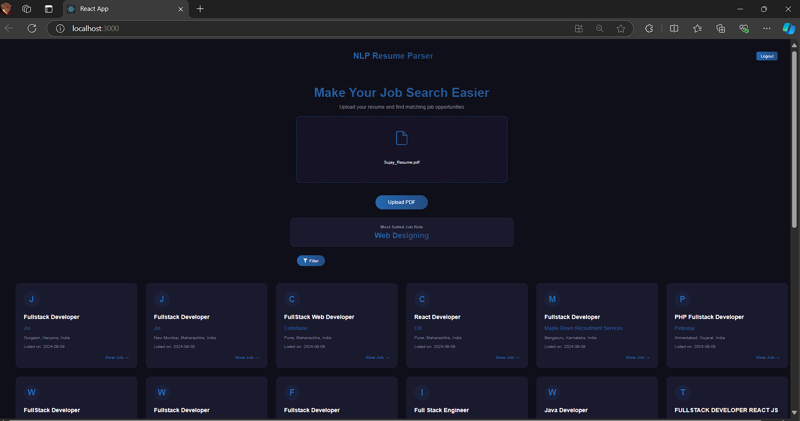

# 🧑‍💼 Resume-Based Job and Course Recommendation System

This project leverages a **BERT model** for resume parsing, integrates with the **LinkedIn API** for job recommendations, and provides course recommendations via the **Gemini API**. The system consists of a **Node.js backend**, **Flask API** for machine learning, and a **React.js frontend** for user interaction.



## 🚀 Features

- **Resume Parsing**: Analyze resumes using a BERT model to predict the most suitable job role.
- **Job Listings**: Fetch relevant job listings using the **LinkedIn API** based on the predicted job role.
- **Course Recommendations**: Get tailored course recommendations via the **Gemini API** to enhance your skills.
- **User Authentication**: Secure login and session management with JWT.
- **Clean UI**: A modern, easy-to-use interface for a seamless user experience.

---

## 🛠️ Tech Stack

### **Frontend**
- [React.js](https://reactjs.org/) – For building a responsive, dynamic UI.
- [React Router](https://reactrouter.com/) – For seamless page navigation.
- [Axios](https://axios-http.com/) – To handle API requests.
- HTML5 & CSS3 – For the app's structure and design.

### **Backend**
- [Node.js](https://nodejs.org/) & [Express](https://expressjs.com/) – Backend server for handling file uploads and API requests.
- [Multer](https://github.com/expressjs/multer) – Middleware for handling file uploads.
- [MongoDB](https://www.mongodb.com/) – For storing user authentication data.
- [Flask](https://flask.palletsprojects.com/) – For the machine learning API.
- [Python](https://www.python.org/) – For running the BERT model and handling course recommendations.
- **LinkedIn API** – To fetch job listings for the predicted job role.
- **Gemini API** – For providing tailored course recommendations.

---

## ⚙️ Installation and Setup

### 1. Clone the repository

```bash
git clone https://github.com/your-username/your-repo-name.git
```

### 2. Install Dependencies for Frontend and Backend

Navigate to the project directory and install the necessary dependencies.

#### Frontend (React)

```bash
cd frontend
npm install
```

#### Backend (Node.js)

```bash
cd backend
npm install
```

### 3. Install Dependencies for Flask API

Navigate to the `resume_parser` directory and create a Python virtual environment:

```bash
cd resume_parser
python -m venv venv
source venv/bin/activate  # For Mac/Linux
venv\Scripts\activate      # For Windows
```

Install the Python dependencies:

```bash
pip install -r requirements.txt
```

### 4. Environment Variables

Make sure to set up your environment variables for both backend and frontend. Create a `.env` file for the backend and add the following:

```bash
MONGODB_URI=your_mongodb_uri
JWT_SECRET=your_jwt_secret
LinkedIn_API_Key=your_linkedin_api_key
LinkedIn_API_Endpoint=https://api.linkedin.com/v2/jobs
GEMINI_API_KEY=your_gemini_api_key
```

### 5. Start the Servers

#### Frontend (React)

```bash
npm start
```

The app will now be running on `http://localhost:3000`.

#### Backend (Node.js)

```bash
npm run start
```

The backend will be running on `http://localhost:5000`.

#### Flask API (Resume Parser)

```bash
cd resume_parser
python app.py
```

The Flask API will be running on `http://127.0.0.1:5001`.

---

## 🧑‍💻 How to Use

### 1. Register/Login
- Sign up for an account, or log in using your existing credentials.
- Your session will be tracked securely using JWT-based authentication.

### 2. Upload Your Resume
- Upload your resume in PDF format.
- The backend will process your resume using the BERT model and predict a **Job Role**.

### 3. Explore Matching Jobs
- Based on your predicted job role, the app will display a list of job listings fetched via the **LinkedIn API**.

### 4. View Course Recommendations
- Under the **Predicted Job Role**, you will see recommended courses from the **Gemini API** to help you gain new skills relevant to your job.

---

## 📂 Project Structure

```
├── backend                # Node.js server to handle file uploads and job/course recommendations
│   ├── server.js          # Main backend file (Express server)
├── frontend               # React frontend for the UI
│   ├── src                # React source files
│       ├── components     # Reusable components
│       └── App.js         # Main frontend file
├── resume_parser          # Flask API for resume parsing and job recommendation
│   ├── app.py             # Main backend file for resume parsing
│   └── requirements.txt   # Python dependencies for Flask API
└── .gitignore             # Git ignore file
```

---

## 🤝 Contributing

Contributions are welcome! Here's how you can help:

1. Fork the project.
2. Create a feature branch (`git checkout -b feature-branch`).
3. Commit your changes (`git commit -m 'Add new feature'`).
4. Push to the branch (`git push origin feature-branch`).
5. Open a Pull Request.


**Don't forget to ⭐ this repository if you found it useful!**
